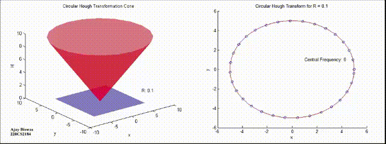

# circular-hough-transform-demonstration

## CONTENTS OF THIS FILE

* Description
* Requirements
* Installation
* Directory Structure
* Usage
* Credits

### Description

Circle Hough Transform or Circular Hough Transform (CHT) is a feature extraction technique which detects circles in imperfect images. The provided source code finds radius of a given circle using CHT. 

The process involves drawing of circles of some radius 'r' on the edge of the given circle. If there are more than two intersections at the center of the given circle, then the radius of the given circle has been found, which is equal to 'r'. 

### Requirements

1. MATLAB

### Installation

Direct Link : https://www.mathworks.com/downloads/

### Directory Structure
    .
    ├── output                                    # Output Images
    │   ├── cht_cone_output.bmp
    │   ├── cht_output.bmp
    ├── src                                          # Source files
    │   ├── CHT.m
    │   ├── CHT_cone.m
    │   ├── circle.m
    ├── video                                      # Demo video
    │   ├── demo.mp4
    ├── demo.gif
    ├── LICENSE
    └── README.md

### Usage

Two MATLAB functions are provided to demonstrate the CHT. CHT.m is used to find radius of a circle with unknown radius and CHT_cone.m shows the selection of a circle from the cross-section of a cone. The circle.m function is used to plot a circle of given radius and x and y coordinate. It also returns the x and y coordinates in the form of an array. Two outputs are provided in the output folder, one for CHT.m and other for CHT_cone.m. The video folder contains the animation of the entire process.

## Credits

Ajay Biswas
M.Tech. National Institute of Technology, Rourkela.

